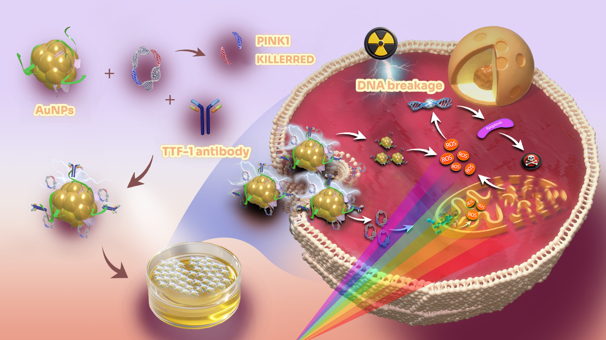

# Crimson Crusader: A novel radiosensitize system targeting lung cancer cells

## This ths a test H2

### This is a test H3

Lung cancer holds the top position in terms of both incidence and mortality rates globally. The non-small cell lung cancer (NSCLC) is a particularly aggressive subtype that constitutes approximately 85% of all lung cancers. Radiotherapy plays a crucial role in the neoadjuvant treatment of NSCLC; however, the outcomes remain less than optimal. Recently, mitochondria and the reactive oxygen species (ROS) have emerged as the important cancer therapeutic targets. KillerRed (KR), a genetically encoded dimeric red fluorescent protein photosensitizer, generates a substantial amount of ROS under visible light, to induce cancer cell destruction. Regarding of the unique advantages of gold nanomaterials (AuNPs) in drug delivery and radiotherapy sensitization, targeted therapy could be achieved through its specific abilities to deliver drug to the site of action.

In our study, we initially constructed a recombinant expression plasmid containing the targeting sequence of Pink1 (PTEN-induced putative kinase 1) to localize KR to ROS-producing mitochondria using recombinant gene technology. This construct was then bound to the stable Au nanoclusters through charge interactions. Additionally, to endow this system with tumor-targeting capabilities, we conjugated the nanoparticles with the cancer cell-targeting antibody TTF-1 via amidation reactions, resulting in the multifunctional nanosystem AuNPs-TTF1-Pink1-mtKR, named as Crimson Crusader. Finally, the lung cancer cells were treated with Crimson Crusader and ionizing radiation, followed by the examination of the intracellular ROS generation and the killing of the cells to confirm the Crimson Crusader has more effective functions of cancer cell targeting and radiosensitizion, expecting to provide a promising new strategy for the clinical treatment of lung cancer.

