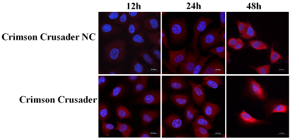

import Image from 'next/image';
import HeadingWithTuntun from '@/components/HeadingWithTuntun';

# Design

<HeadingWithTuntun title='Overview'>
  <Image
    src='/tuntun/5.png'
    width={100}
    height={100}
    className='absolute -top-[4rem] right-0 mx-auto w-24 sm:-top-[6.2rem] sm:right-4 sm:w-32 md:-top-[7.3rem] md:w-36 lg:-top-[9rem] lg:w-44'
    alt='Tuntun'
  />
</HeadingWithTuntun>

We initially constructed a recombinant expression plasmid containing the targeting sequence of Pink1 (PTEN-induced putative kinase 1) to localize KR to ROS-producing mitochondria using recombinant gene technology. This construct was then bound to the stable Au nanoclusters through charge interactions. Additionally, to endow this system with tumor-targeting capabilities, we conjugated the nanoparticles with the cancer cell-targeting antibody TTF-1 via amidation reactions, resulting in constructing a multifunctional nanosystem AuNPs-TTF1-Pink1-mtKR, named as Crimson Crusader (Fig 1).

## Gold nanoparticles

The organic ligands on the surface of the gold nanoparticles (AuNPs) in this project consist of three main components.

The first part is the anchoring group, which directly interacts with the gold atoms (Au(I) or Au(0)) on the nanoparticle surface. This component typically includes several elements, such as sulfur (S), selenium (Se), phosphorus (P), or carbon (C), which form strong covalent bonds with the gold surface. The nature of these anchoring groups plays a critical role in determining the structure and physicochemical properties of gold-based nanomaterials.

The second part of the ligand consists of the main or intermediate group, such as alkyl chains of varying lengths or benzene rings, with or without alkyl substitutions. Beyond providing conjugation, this segment of the ligand is involved in a range of molecular interactions, including hydrophobic forces and van der Waals interactions, with the AuNP surface. These forces influence the nanoparticles' structural and physicochemical properties by altering the spatial arrangement and electron transfer dynamics at the nanoparticle surface.

The third component is the functional group, typically present in hydrophilic ligands, such as carboxyl (-COOH) or amine (-NH2) groups. These functional groups are essential for ensuring the solubility of AuNPs in aqueous solutions and for their performance in various applications. The presence of these groups significantly influences the interactions of AuNPs with their external environment, including solvents, biomolecules, cells, and tissues.

## Pink1-mtKR plasmid

The structures of the Pink1-mtKR plasmid in our project are outlined in Fig. 3A. PCR amplifications were performed to verify the KillerRed and Pink1 products, with sizes of 735 bp and 102 bp, respectively (Fig. 3B). After enzyme digestion, DNA ligation, product transformation, single-clone isolation, plasmid extraction, and DNA sequencing, the sequencing results were compared with their corresponding sequences in GenBank, The sequences were found to be fully correct, confirming the successful construction of the plxsp-flag-Pink1-KillerRed (Pink1-mtKR) plasmid.

  

    (A) Schematic diagram of mtKR vectors: Pink1-MTS was cloned into empty vector
    (plxsp-flag) (Not I and EcoR I sites),KillerRed were cloned into
    plxsp-flag-Pink1-MTS (EcoR I and BamH I sites).
  

  

    (B) PCR products of KillerRed and Pink1-MTS.Lane 1 was 1000 bp DNA Marker,
    lane 2 and 3 were PCR amplification products.
  

## Crimson Crusader

After successfully constructing the Crimson Crusader nanosystems, we characterized their morphology to ensure effective cellular uptake and functionality. Transmission electron microscopy (TEM) revealed that the Crimson Crusader particles exhibited a spherical shape with an average size of 25.28 nm (Fig. 4.1). Based on theoretical analysis, we hypothesized that Crimson Crusader could enter cells through mechanisms such as endocytosis and membrane fusion. To further assess the stability of Crimson Crusader inside the cells, we evaluated plasmid expression in tumor cells using immunofluorescence (IF) with a FLAG-tag-specific fluorescent antibody. As shown in Fig. 4.2, plasmid expression continued to increase steadily over a 48-hour period following the addition of Crimson Crusader, indicating that the nanosystem remains stable within the cells and can efficiently express the target protein. These results confirm that Crimson Crusader is capable of entering cells effectively and performing its intended function.

  

    (A) Morphology of the Crimson Crusader;
  

  

    (B) Size statistics of Crimson Crusader.
  

