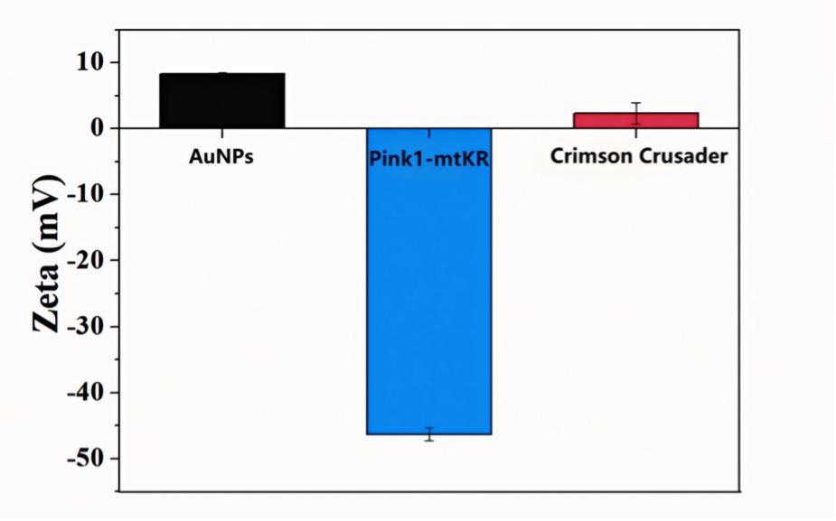
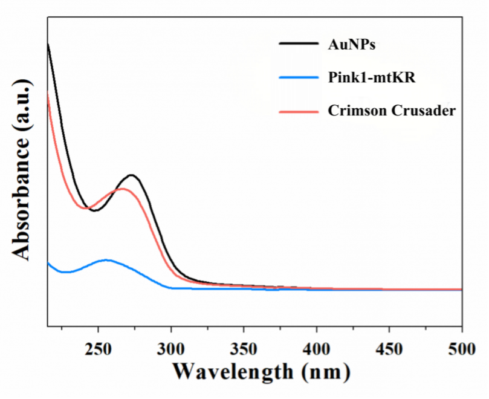
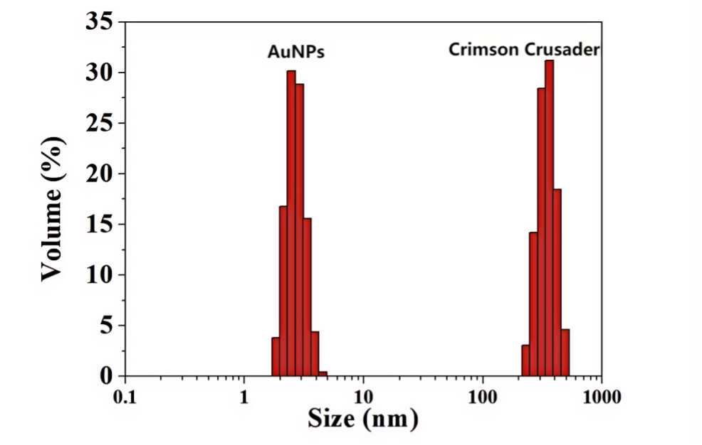
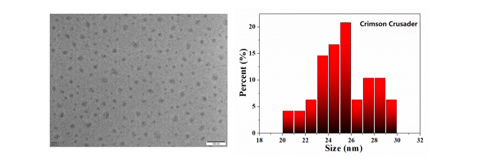
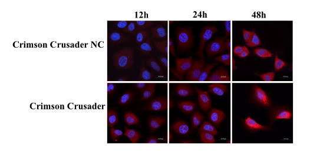
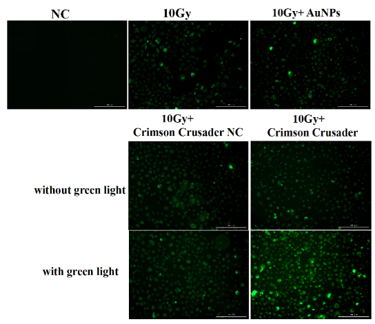
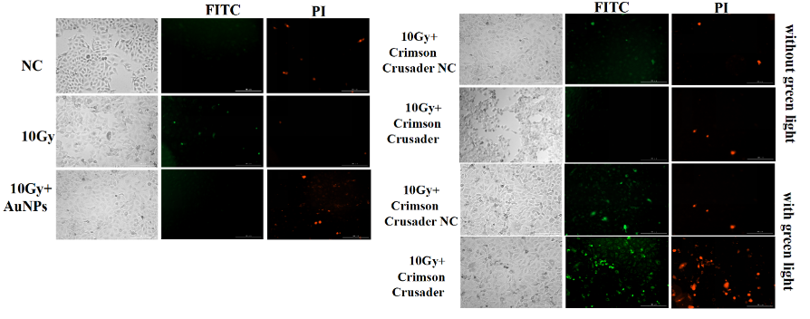
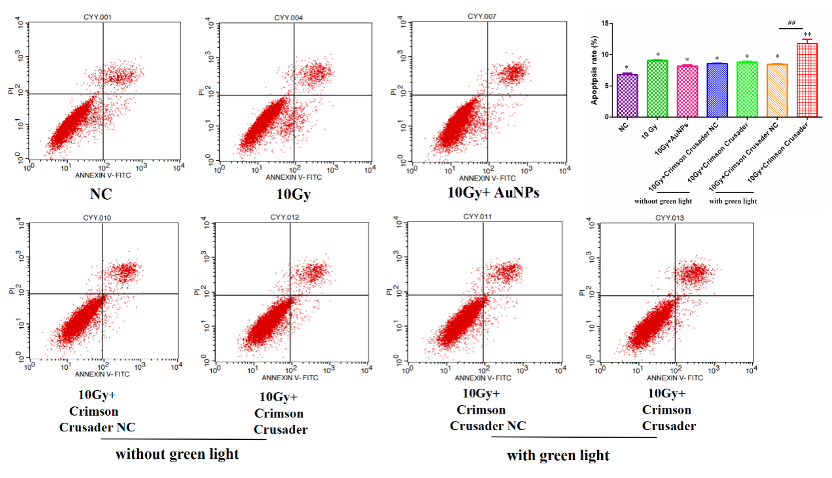
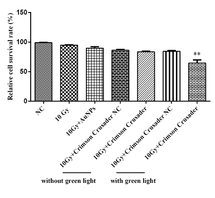

import Image from 'next/image';
import HeadingWithTuntun from '@/components/HeadingWithTuntun';

# Experiment

<HeadingWithTuntun title='' mt={0}>
  <Image
    src='/tuntun/4.png'
    width={100}
    height={100}
    className='sm:w-30 absolute -right-2 -top-[4.6rem] w-20 sm:-top-[4.6rem] sm:right-4 lg:-top-[7.5rem] lg:w-32'
    alt='Tuntun'
  />
</HeadingWithTuntun>

### SUMMARY OF KEY RESULTS:

The main focus of this project is on testing out the functions of the multifunctional nanosystem AuNPs-TTFI-Pink1-mtKR (Crimson Crusader), to demonstrate its feasibility for targeting and ability of radiosensitization under the combined ionizing radiation (IR) treatment of lung cancer cells.

First, we measured the structural characterization of the nanosystem to verify that the binding of the material to the plasmid was successful.

Next, we measured the morphological characterization of the nanosystem to ensure its successful entry into the cell, and used immunofluorescence experiments to clarify its stability inside the cell.

After that, we examined the changes in the amount of intracellular ROS after cells were exposed to IR.

Finally, in order to more clearly and quantitatively show the cell-killing effect of ROS produced by KillerRed expositing to green light followed by IR, we detected the lethal effect of KillerRed using apoptosis experiments in A549 cells, and further verified the radiation sensitizing effect of KillerRed by performing cell survival analysis.

### MATERIAL SYNTHESIS AND STRUCTURAL CHARACTERIZATION:

**Background:**

The construction of the nanosystem Crimson Crusader is the basis of our experiment. So, we tested the structural characterization of the synthetic material to verify the successful establishment of the material system.

**Materials and Methods:**

We measured the Zeta potential of the composite material by dynamic light scattering, and obtained the UV-VIS absorption spectrum by spectral analysis, and measured the hydrated particle size by dynamic light scattering.

**Results and Discussion:**

As the results shown in Figure 1, we can see that AuNPs synthesized with SH-PEl as ligand carried positive charges (+8.27mV), while plasmids was charged negatively (-46.31mV). The materials bonded by supramolecular interaction were close to electric neutrality (+2.34mV), which proves its successful connection.

In Figure 2, we can see that the peak of AuNPs showed up at 273nm, which represented an increase in the strength of the characteristic peaks of metal-sulfhydryl binding. The peak of Pink1-mtKR appeared at 255nm. The characteristic peaks of Crimson Crusader were blue shifted compared with AuNPs, indicating that these two parts were successfully combined.

In Figure 3, we can see that after binding Pink1-mtKR, the hydrated particle size of AuNPs-Pink1-mtKR increased. According to this result, we can further prove that the material was successfully attached to the plasmid.

After the identification of the above three methods, we can conclude that the multifunctional nanosystem Crimson Crusader was complete.

### MORPHOLOGY CHARACTERIZATION:

**Background:**

To determine the Crimson Crusader's ability to enter the cell and be functional, we analysis its morphology.

**Materials and Methods:**

We used Transmission Electron Microscope (TEM) to characterize the morphology.

**Results and Discussion:**

As the results shown in Figure 4, we can see that the Crimson Crusader has a spherical structure with an average diameter of 25.28nm. Based on the theoretical analysis, we hypothesized that Crimson Crusader could enter into the cell interior through the mechanisms of endocytosis and membrane fusion.

### INTRACELULAR STABILITY OF CRIMSON CRUSADER

**Background:**

To determine the intracellular stability of Crimson Crusader, the expression of plasmids in tumor cells was detected by immunofluorescence (IF) using the flag-tagged fluorescent antibodies.

**Materials and Methods:**

Sterile slides were placed in a six-well plate for cell climbing. Crimson Crusader and its negative control (Crimson Crusader and Crimson Crusader NC) were added 12h later, and slides were collected after 12h, 24h and 48h. The cells were fixed with 4% formaldehyde for 10min, and then soaked in 1% Triton X-100 at room temperature for 10min. Subsequently, cells were incubated with 5% bovine serum albumin closed and then add flag-tagged primary antibody at 4°C overnight. On the second day, the cells were incubated with the fluorescent secondary antibody at 37°C for 1 hour. Finally, the cells were stained with DAPI and photographed with confocal microscopy.

**Results and Discussion:**

In Figure 5, the results shown that after adding Crimson Crusader for 48h, the expression levels of the plasmid were still continuously increased, indicating that the composite material could stably exist in cells and efficiently express the target protein.

### THE IMPACT OF KILLERRED ON INTRACELULAR ROS LEVELS

**Background:**

To demonstrate the effect of KillerRed on the production of intracellular ROS under green light exposure and the changes in ROS levels after combined irradiation, we detected the production of ROS in cells under the conditions of 10Gy irradiation after 30min of green light exposure.

**Materials and Methods:**

A549 cells were seeded in 6-well culture plates, pre-treated with AuNPs and Crimson Crusader NC and Crimson Crusader for 24h, then exposed to green light for 30min to activate the ROS production activity of KillerRed, followed by 10Gy (dose rate of 1.0Gy/min) IR treatment. Intracellular ROS levels were assessed using the DCFH-DA 3h later. Green fluorescence intensity was measured using the BioTek Cytation3 (Agilent, USA) at an excitation wavelength of 485 nm and an emission wavelength of 528 nm.

**Results and Discussion:**

According to the results in Figure 6, the AuNPs group produced more ROS than the control group (NC and 10Gy) after irradiation, indicating that AuNPs can generate ROS on their own. The Crimson Crusader group produced more ROS than the Crimson Crusader NC group under green light, domenstrated that KillerRed could increase the levels of ROS to kill cells after green light activation.

### THE IMPACT OF KILLERRED ON CELL APOPTOSIS

**Background:**

To verify the cell-killing effect of KillerRed after ROS production, we further examined the apoptosis of A549 cells after various treatment condition.

**Materials and Methods:**

After irradiation, cells were collected by centrifugation and washed with PBS, and then cell apoptosis was detected using the Annexin V-FITC cell apoptosis detection kit (Beyotime, China). In brief, 200 μL of Annexin V-FITC binding solution was added to gently resuspend the cells. Then, 10 μL of PI staining solution was added, and the mixture was thoroughly mixed. The cells were then incubated in the dark at 37°C for 20min. Green fluorescence intensity was measured using the BioTek Cytation3 (Agilent, USA) at an excitation wavelength of 485 nm and an emission wavelength of 528 nm, and red fluorescence intensity was measured and photographed at an excitation wavelength of 530 nm and an emission wavelength of 590 nm. Meanwhile, flow cytometry analysis was performed using a flow cytometer (BD Biosciences, USA).

**Results and Discussion:**

The results of Figure 7 shown that most A549 cells treated with Crimson Crusader shrank and died under green light. After IF experiments with FITC and PI, the green (FITC) and red (PI) fluorescence was observed under a fluorescence microscope. Compared with the group without green light, the green fluorescence and the red fluorescence was stronger in the group with green light. The results of flow cytometry (figure 8) further proved that Crimson Crusader induces more apoptosis in A549 cells under the green light (P\<0.05).

### THE IMPACT OF KILLERRED ON CELL SURVIVAL

**Background:**

To identify the cell-killing effect of ROS produced by KillerRed combined with irradiation, we further validated the killing effect of KillerRed after irradiation through cell CCK-8 experiments.

**Materials and Methods:**

Cell (approximately 5000 cells/well) was seeded in each well of a 96-well plate. The plate was then incubated in a humid incubator for 24h (37°C, 5% CO2). Different concentrations of the test substance (10 ng/mL) were added to the wells, and incubated for 48h, then 10 μL of CCK-8 solution was added to each well of the plate, and the plate was incubated in the incubator for 2.5h. Absorbance at 450 nm was then measured using a plate reader.

**Results and Discussion:**

In Figure 9, the number of cells in the Crimson Crusader group was significantly reduced compared to the Crimson Crusader NC group, indicating that after adding KillerRed, the green light activation of KillerRed has a stronger cell-killing effect, leading to a significant reduction in the number of surviving cells (P\<0.05).

