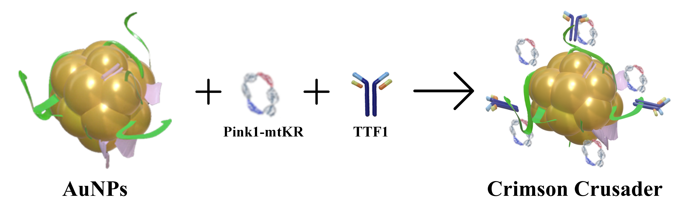

import Image from 'next/image';
import HeadingWithTuntun from '@/components/HeadingWithTuntun';

# Project

<HeadingWithTuntun title='Background'>
  <Image
    src='/tuntun/3.png'
    width={100}
    height={100}
    className='absolute -top-[3.2rem] right-0 mx-auto w-24 sm:-top-[5rem] sm:right-4 sm:w-32 md:-top-[8rem] md:w-44 lg:-top-[7.5rem]'
  />
</HeadingWithTuntun>

Image credit: Global cancer statistics 2022

**Non-small cell lung cancer (NSCLC) is the most prevalent subtype of lung cancer, accounting for approximately 85% of all lung cancer cases.** According to global cancer statistics, the incidence and mortality rates of NSCLC are rising annually. The clinical manifestations of NSCLC are diverse, in the early-stage, the patients may present with few or no symptoms, and common manifestations of the advanced stages include persistent cough, chest pain, shortness of breath, and weight loss, which usually results in many patients being diagnosed at advanced stages, limiting their treatment options.

As our understanding of the biological mechanisms underlying NSCLC deepens, molecular targeted therapies and immunotherapies have emerged as significant areas of research for developing its therapeutic methods. Targeted drugs, such as EGFR inhibitors and ALK inhibitors, are now widely used in clinical settings, however, their therapeutic efficacy is often limited due to tumor cell heterogeneity and the complexity of drug resistance mechanisms. Additionally, radiotherapy and chemotherapy remain crucial in the management of NSCLC. Nonetheless, conventional radiotherapy frequently causes damage to surrounding healthy tissues and may result in severe side effects for patients. Therefore, it is critical and urgent to select a radiotherapy sensitizing drug targeting tumor cells of NSCLC.

In recent years, researchers have increasingly recognized the critical role of mitochondria in energy metabolism and apoptosis in cancer cells. When mitochondria are stimulated by external factors, such as radiation or acetaldehyde, the production of the **reactive oxygen species (ROS)** significantly increases. ROS is a primary molecule generated under oxidative stress in the body and has been considered as a key factor in tumorigenesis, progression, and recurrence. However, recent studies suggest that ROS could be a barrier for therapeutic purposes by promoting tumor cell death. Currently, the drugs designed to elevate ROS levels in tumor cells are gradually introduced in clinical settings. **KillerRed (KR)**, a genetically encoded photosensitizer constructed using the non-fluorescent and non-phototoxic chromoprotein anm2CP from jellyfish, can generate substantial amounts of ROS when exposed to the visible light, especially green light. It property effectively induces apoptosis in cancer cells, highlighting KillerRed's unique application potential for cancer treatment and for enhancing the effects of radiotherapy.

## Problem

Despite the critical role of radiation therapy in treating NSCLC, it has encountered important challenges in recent years, **including to the reducing radiosensitivity and the suboptimal therapeutic effects.** These challenges are likely to link with the alterations in the tumor microenvironment, the heterogeneity of tumor cells, and the development of drug resistance mechanisms.

Within the NSCLC microenvironment, the complex interactions among tumor-associated fibroblasts, immune cells, and tumor cells can create a protective barrier that diminishes the effectiveness of radiotherapy. Furthermore, the cellular heterogeneity of NSCLC leads to various responses to radiotherapy among cells from different patients and tumor sites. Some tumor cells may acquire resistance through the enhancing DNA repair mechanisms or inhibiting signals that promote cell death. This resistance not only complicates treatment but also elevates the risk of disease recurrence.

Consequently, researchers are actively investigating the novel sensitization strategies to enhance the efficacy of radiotherapy for NSCLC. One promising approach is the application of nanotechnology in drug delivery systems, which can target tumor cells using nanocarriers to improve the selectivity and effectiveness of treatment. By designing and optimizing these targeted delivery systems, it may be possible to significantly enhance the effectiveness of radiotherapy and improve patient prognosis.

## Challenge

Therefore, in this project, we aim to develop a new targeted drug for NSCLC treatment that possesses strong targeting properties and enhances the effects of radiotherapy. Meanwhile, we face several challenges during the construction process:

1. We should select a drug with high toxicity to NSCLC cells while minimizing toxicity to normal cells.
2. We need to identify a nanocarrier that can effectively deliver the drug to tumor cells. This carrier should exhibit excellent biocompatibility, stability, and targeting capabilities to ensure accurate delivery to the site of action.
3. We need to design a mechanism that facilitates the accumulation of the drug in tumor cells and generates a substantial amount of tumor cell-killing substances to enhance the efficacy of radiotherapy.

## Solution

To address the challenges outlined above, we selected KillerRed as our drug due to its protein properties, which allow for targeted localization to NSCLC cells and accumulation in the mitochondria, where it generates reactive oxygen species (ROS) to induce cell death while minimizing effects on normal cells. To facilitate this, we constructed recombinant expression vectors using the mitochondrial localization signal from PTEN-induced putative kinase 1 (Pink1) to direct KillerRed to ROS-generating mitochondria, stabilizing it on gold nanoparticles through charge interactions. We chose gold nanoclusters (AuNPs) as our nanocarriers, leveraging their unique optical and electronic properties. AuNPs can effectively bind functionalized molecules to their surfaces through charge interactions, making them ideal for drug delivery. Additionally, their excellent biocompatibility and stability ensure reliable transport of the drug to the intended site of action. Furthermore, AuNPs serve as the effective radiotherapy sensitizers by depositing radiation energy within the tumor, thereby enhancing the effects of radiotherapy. To achieve the purpose of targeted delivery to NSCLC, we considered the high expression of thyroid transcription factor 1 (TTF-1) in NSCLC cells, and employed amidation reactions to conjugate the TTF-1 targeting agent to the nanoparticles, theoretically enabling efficient drug delivery to the tumor site for NSCLC treatment. **Ultimately, we successfully constructed the multifunctional nanosystem AuNPs-TTF1-Pink1-mtKR,dubbed "Crimson Crusader",** which integrating NSCLC-targeting proteins, mitochondrial localization proteins, ROS-inducing agents, and gold nanostructures. The Crimson Crusader is anticipated to be a novel and effective strategy for the clinical treatment of lung cancer, depending on its superior targeting and sensitization capabilities in radiotherapy.

## Goals

The specific objectives of this project are as follows:

**Construction of Targeting Vectors:** We aim to develop the KillerRed recombinant expression vectors mediated by the Pink1 targeting sequence using genetic recombination technology. This approach will ensure the effective localization of KillerRed in mitochondria, leading to increased ROS production and enhanced cytotoxicity against cancer cells.

**Binding to Gold Nanomaterials:** The constructed KillerRed vectors will be bound to the stabilized AuNPs through charge interactions. This strategy not only enhances the stability and biocompatibility of the drug but also improves its sensitizing potential in radiotherapy, as demonstrated in several studies.

**Development of Multifunctional Nanosystems:** We will conjugate nanoparticles with the NSCLC-targeting agent TTF-1 via an amidation reaction, resulting in the multifunctional nanosystem AuNPs-TTF1-Pink1-mtKR, named as "Crimson Crusader." We will validate the targeting efficiency and radiotherapy sensitization capabilities of this system in combination with ionizing radiation treatment for lung cancer cells, providing a novel and effective strategy for the clinical treatment of lung cancer.

By achieving these objectives, the project aims to introduce new ideas and methodologies for treating NSCLC, ultimately improving the effectiveness of radiotherapy and enhancing patient survival rates.

## Feasibility

The construction of recombinant expression vectors using recombinant gene technology is a well-established technique in molecular biology and has been widely applied in various biomedical studies. KillerRed, a phototoxic red fluorescent protein, generates reactive oxygen species (ROS) upon light exposure, which can be toxic to cells. By sublocalizing KillerRed to the mitochondria through genetic recombination techniques, we can enhance its cytotoxic effects specifically in tumor cells.

Binding functionalized molecules to AuNPs through charge interactions is a common functionalization strategy, leveraging their unique optical and electronic properties. Previous studies have successfully constructed multifunctional nanoprobes for tumor diagnosis and therapy using similar methodologies. Gold-based nanomaterials, with their high atomic number (Z), exhibit strong attenuation of X-rays or γ-rays, making them to be the excellent radiosensitizers. This property allows for more effective deposition of radiation energy within tumors, to improve the efficacy of radiation therapy (RT).

TTF-1 is highly expressed in NSCLC and serves as a potential targeting agent. The attachment of TTF-1 to nanoparticles through amidation reactions is expected to enhance the targeting capability of the nanosystems, facilitating the delivery of therapeutic agents to designated sites.

The integration of targeting, radiotherapy sensitization, and drug delivery functions into the nanosystems represents a current hotspot in the field of nanomedicine research. Similar multifunctional nanosystems have been successfully developed, demonstrating both efficacy and safety in tumor treatment. With our well-equipped laboratory, experienced research instructors, proficient students, and a robust biosafety assessment system, we are well-positioned to complete these projects within the stipulated timeframe while ensuring laboratory safety and legal compliance.

In summary, the proposed construction scheme for the multifunctional nanosystem is technically feasible, supported by relevant studies indicating its potential therapeutic effects. However, rigorous preclinical and clinical trials are necessary to validate its safety and efficacy before progressing from laboratory research to clinical application.

## Reference

Adeloye D, Song P, Zhu Y, et al. Global, regional, and national prevalence of, and risk factors for, chronic obstructive pulmonary disease (COPD) in 2019: a systematic review and modelling analysis. Lancet Respir Med. 2022 May;10(5):447-58.

Varmaghani M, Dehghani M, Heidari E, et al. Global prevalence of chronic obstructive pulmonary disease: systematic review and meta-analysis. East Mediterr Health J. 2019 Mar 19;25(1):47-57.

Chen P, Li Y, Wu D, et al. Secondhand smoke exposure and the risk of chronic obstructive pulmonary disease: a systematic review and meta-analysis. Int J Chron Obstruct Pulmon Dis. 2023;18:1067-76.

Wold LE, Tarran R, Crotty Alexander LE, et al. Cardiopulmonary consequences of vaping in adolescents: a scientific statement from the American Heart Association. Circ Res. 2022 Jul 22;131(3):e70-82.

Rose JJ, Krishnan-Sarin S, Exil VJ, et al. Cardiopulmonary impact of electronic cigarettes and vaping products: a scientific statement from the American Heart Association. Circulation. 2023 Aug 22;148(8):703-28.
World Health Organization. WHO tobacco knowledge summaries: tobacco and chronic obstructive pulmonary disease (COPD). Nov 2023 [internet publication].

Hurst JR, Vestbo J, Anzueto A, et al; Evaluation of COPD Longitudinally to Identify Predictive Surrogate Endpoints (ECLIPSE) Investigators. Susceptibility to exacerbation in chronic obstructive pulmonary disease. N Engl J Med. 2010 Sep 16;363(12):1128-38.

Maltais F, Bjermer L, Kerwin EM, et al. Efficacy of umeclidinium/vilanterol versus umeclidinium and salmeterol monotherapies in symptomatic patients with COPD not receiving inhaled corticosteroids: the EMAX randomised trial. Respir Res. 2019 Oct 30;20(1):238.

Kerkhof M, Voorham J, Dorinsky P, et al. Association between COPD exacerbations and lung function decline during maintenance therapy. Thorax. 2020 Sep;75(9):744-53.

Axson EL, Lewis A, Potts J, et al. Inhaled therapies for chronic obstructive pulmonary disease: a systematic review and meta-analysis. BMJ Open. 2020 Sep 29;10(9):e036455.

Rogliani P, Ritondo BL, Gabriele M, et al. Optimizing de-escalation of inhaled corticosteroids in COPD: a systematic review of real-world findings. Expert Rev Clin Pharmacol. 2020 Sep;13(9):977-90.

Janjua S, Fortescue R, Poole P. Phosphodiesterase-4 inhibitors for chronic obstructive pulmonary disease. Cochrane Database Syst Rev. 2020 May 1;(5):CD002309.
